# C4 Level 3: Component Diagram (Backend API)

This document deconstructs the **Express Backend API** container into its key logical components (services, controllers, and workers) and details their structural relationships.

## Diagram

```mermaid
graph TB
    %% Define API Border
    subgraph ExpressBackend ["Express Backend API Container"]
        %% Controllers
        Router["HTTP Router / Middleware<br>(Express / JWT / CORS)"]
        
        %% Services (Components)
        AuthService["Auth Service<br>(TypeScript Component)<br><br>Manages session nonces, verifies wallet signatures, generates tokens."]
        
        CourseService["Course & Content Service<br>(TypeScript Component)<br><br>Manages catalog, retrieves lessons, validates quiz completions."]
        
        ContractService["Contract Service<br>(TypeScript Component)<br><br>Builds Soroban transaction envelopes, manages gas, coordinates admin-authorized contract calls."]
        
        UploadService["Upload Service<br>(TypeScript Component)<br><br>Buffers student upload evidence, coordinates multipart IPFS pins."]
        
        EmailService["Email Service<br>(TypeScript Component)<br><br>Sends notifications (enrollment, milestone review, DAO updates)."]
        
        %% Background Workers
        Indexer["Event Indexer Worker<br>(Background Thread / Node Worker)<br><br>Polls Stellar RPC for new blocks/events, decodes event data, handles idempotency."]
    end

    %% Database & Cache (C4 level 2)
    DB[("PostgreSQL Database<br>(Relational Tables)")]
    Redis[("Redis Cache<br>(Key-Value Store)")]

    %% External Systems (C4 level 1)
    StellarRpc["Stellar RPC / Horizon Nodes"]
    IPFS["IPFS Pinning API (Pinata)"]
    SMTP["Email Delivery Service (Sendgrid)"]
    ClientApp["React Frontend Client"]

    %% Connections
    ClientApp -->|HTTP Requests| Router
    Router -->|Route Delegation| AuthService
    Router -->|Route Delegation| CourseService
    Router -->|Route Delegation| UploadService
    
    AuthService -->|1. Verify signature & load profiles| DB
    AuthService -->|2. Check/Set session state| Redis
    
    CourseService -->|1. Load lessons & quizzes| DB
    CourseService -->|2. Validate quiz scores| DB
    CourseService -->|3. Cache catalog queries| Redis
    CourseService -->|4. If quiz passed, trigger LRN mint| ContractService
    
    UploadService -->|1. Register pinned assets| DB
    UploadService -->|2. Upload files via multipart API| IPFS
    UploadService -->|3. Register evidence path| DB
    
    ContractService -->|1. Check nonces and tx records| DB
    ContractService -->|2. Submit transactions| StellarRpc
    
    Indexer -->|1. Continuous polling| StellarRpc
    Indexer -->|2. Check/Set indexer checkpoint| Redis
    Indexer -->|3. Record raw events / update DB state| DB
    Indexer -->|4. Trigger notifications on key events| EmailService
    
    EmailService -->|Sends transactional email| SMTP
    
    classDef router fill:#373a40,stroke:#22252a,stroke-width:2px,color:#fff;
    classDef service fill:#2b8a3e,stroke:#2f9e44,stroke-width:2px,color:#fff;
    classDef db fill:#1098ad,stroke:#0b7285,stroke-width:2px,color:#fff;
    classDef external fill:#e67e22,stroke:#d35400,stroke-width:2px,color:#fff;

    class Router router;
    class AuthService,CourseService,ContractService,UploadService,EmailService,Indexer service;
    class DB,Redis db;
    class StellarRpc,IPFS,SMTP,ClientApp external;
```

## Component Descriptions & Responsibilities

### 1. HTTP Router & Middleware
*   **Responsibilities**: Registers the API endpoints, intercepts incoming JSON requests, enforces CORS policies, validates request payloads using OpenAPI validation, checks JWT authorization headers, and limits request frequencies via Redis.
*   **File Scope**: `server/src/routes/`, `server/src/middleware/`

### 2. Auth Service
*   **Responsibilities**: Provides a secure challenge-response wallet login. Generates cryptographic nonces, validates Stellar client-signed payloads (using the SDK's signature verification functions), and provisions stateless JSON Web Tokens (JWT).
*   **File Scope**: `server/src/services/auth.ts`, `server/src/db/nonce-store.ts`

### 3. Course & Content Service
*   **Responsibilities**: Manages the publication of courses and lesson outlines. Compiles and scores quiz submissions, records learner progress metrics, and coordinates milestone review requests.
*   **File Scope**: `server/src/services/course.ts`, `server/src/db/milestone-store.ts`

### 4. Contract Service
*   **Responsibilities**: Serves as the off-chain bridge to the Soroban VM. Houses the admin signing keys, manages fee strategies, constructs Stellar transaction envelopes, signs them, and submits them to the Stellar network.
*   **File Scope**: `server/src/services/contract.ts` or similar blockchain interaction wrappers.

### 5. Upload Service
*   **Responsibilities**: Decodes multipart upload requests. Encodes file content buffers, pins the media documents to decentralized storage nodes (via Pinata API), and saves active gateway links in the IPFS uploads table.
*   **File Scope**: `server/src/services/upload.ts` or `server/src/db/flagged-content-store.ts`

### 6. Event Indexer Worker
*   **Responsibilities**: Operates in a background daemon thread. Continually polls the Stellar RPC endpoint for new ledger boundaries. Filter events matching the hashes of deployed contracts (`LearnToken`, `GovernanceToken`, `ScholarshipTreasury`, `MilestoneEscrow`, `ScholarNFT`). Emits database sync queries and notifies scholars upon successful review verification.
*   **File Scope**: `server/src/workers/indexer.ts` or `server/src/db/migrations/004_events.sql`
