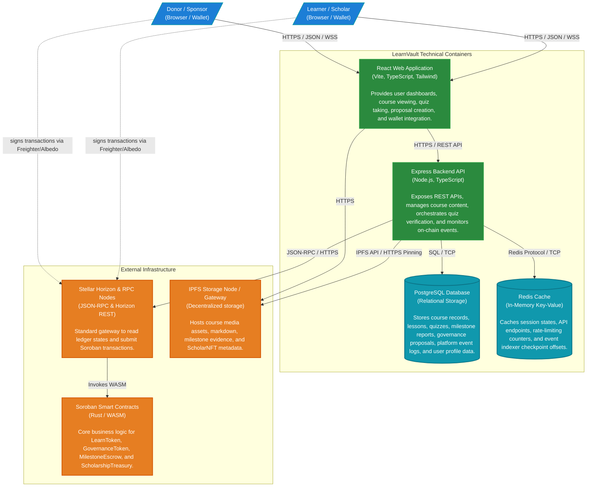

# C4 Level 2: Container Diagram

This document details the containers that make up the **LearnVault** platform. It illustrates the high-level technical architecture, tech stack, and communications protocols.

## Diagram

## Container Specifications

| Container | Technology Stack | Purpose | Data Persistence |
| :--- | :--- | :--- | :--- |
| **React Web Application** | React, Vite, TypeScript, Vanilla CSS, Stellar SDK (Freighter / Albedo) | Serves the interactive user interface. Enables donors to deposit funds and scholars to enroll in courses, upload coursework, and interact with the DAO governance module. | Ephemeral browser storage (LocalSession / Redux cache) |
| **Express Backend API** | Node.js, Express, TypeScript, Knex.js | Serves core RESTful endpoints, parses coursework uploads, processes course enrollments, coordinates IPFS pinning, and executes background event-indexing tasks. | Stateless |
| **PostgreSQL Database** | PostgreSQL v15+ | Acts as the primary transactional datastore for all course layouts, learner profiles, audits, comments, local proposals, votes, and event index logs. | Persistent Relational Storage (Volume mapped) |
| **Redis Cache** | Redis v7+ | Accelerates session management, rate limits high-frequency endpoints, caches heavy aggregation queries, and tracks indexing process milestones. | In-Memory (Optional snapshotting) |
| **Soroban Smart Contracts** | Rust, Soroban SDK | Enforces trustless token economics, holds escrows, verifies milestone completions, issues credentials, and secures governance voting power on-chain. | Persistent Stellar Ledger State |
| **IPFS Storage** | Pinata / IPFS Gateways | Decentralized directory structure for binary materials, cover pictures, and JSON schemas representing Soulbound NFT credentials. | Distributed, content-addressed storage |
