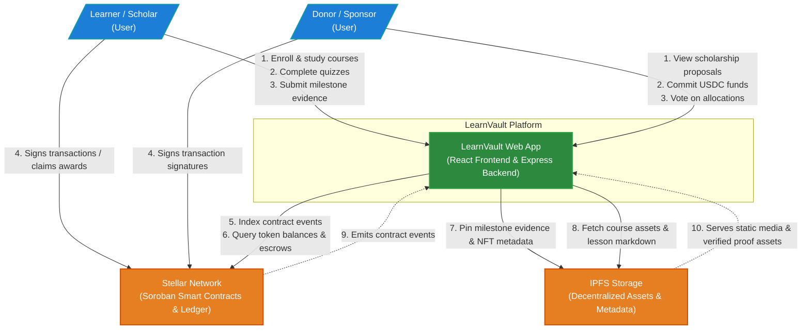

# C4 Level 1: System Context Diagram

This document describes the high-level system context for the **LearnVault** platform. It illustrates the primary actors, the core system boundaries, and external dependencies.

## Diagram

## System Boundaries & Roles

### Actors (Users)
*   **Learner / Scholar**: Completes courses, completes quizzes, submits milestone completion reports for review, earns reputation tokens (LRN), and receives scholarship distributions.
*   **Donor / Sponsor**: Funds scholarships with USDC, receives governance voting tokens (GOV), and votes on student scholarship proposals and milestone reviews.

### Core System
*   **LearnVault Web App**: The central user interface and coordinating API backend. It handles learner progress, course catalogs, quiz validation, and triggers the on-chain operations.

### External Systems
*   **Stellar Network**: The secure layer of execution. Soroban smart contracts track the reputation tokens (LRN), manage scholarship escrow accounts, distribute tranches on milestone verification, and govern proposal votes.
*   **IPFS (InterPlanetary File System)**: Decentralized storage for lesson content, course media cover assets, submitted milestone evidence files, and the metadata definitions for scholar credential NFTs.
