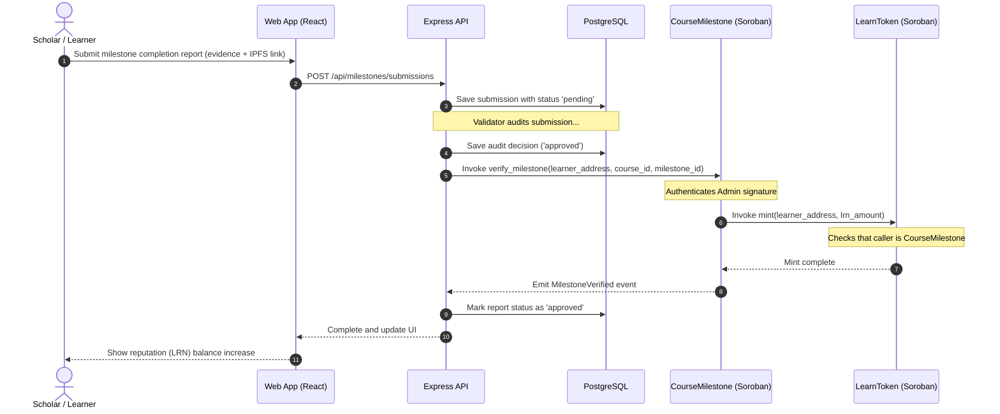
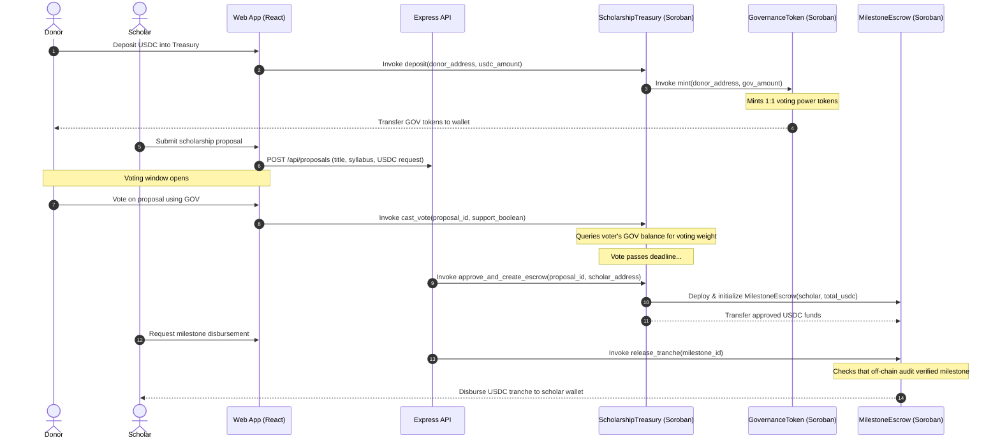
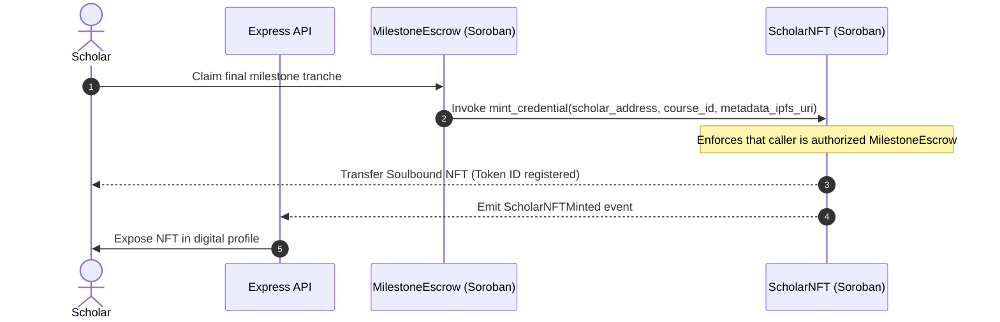

# Smart Contract Interactions & Security Model

This document maps the runtime interaction sequences for core blockchain transactions in **LearnVault** and details the administrative security and authority model.

---

## Key Transaction Flows

### 1. Milestone Completion → LRN Mint
Tracks how a learner completes a course unit, receives off-chain audit verification, and earns non-transferable reputation tokens on-chain.

---

### 2. Donor Deposit → GOV Token → Vote → Escrow Tranche Release
Details the full lifecycle of a funded scholarship program from USDC deposit, voting, proposal approval, and escrow tranche release.

---

### 3. Scholar NFT Issuance
Issued automatically as a Soulbound credential upon complete verification of all milestones within a funded scholarship program.

---

## Admin Authority Model

To guarantee the security of funds and system configurations, the LearnVault Soroban smart contracts enforce a rigid two-phased authority model:

### V1 Multi-Sig Authority (Bootstrap Phase)
In the initial release (V1), administrative authority is centralized under the founding team's multi-sig wallet:

*   **Authentication Check**: Critical admin functions (such as `add_course` in `CourseMilestone` or `upgrade` in all core contracts) are guarded by Soroban's native `require_auth()` signature verification.
*   **Signature Verification**: The contracts store the authorized `admin` address. During execution, `require_auth()` checks that the transaction caller matches this address, resolving signatures through whatever N-of-M multi-signature rule the admin account enforces.
*   **Upgrade Capability**: Admin keys can call `upgrade(new_wasm_hash)` to replace contract executable bytes in-place. Storage configurations are preserved.

### V2 Decentralized Governance (DAO Phase)
Once the platform stabilizes, upgrade keys and administrative roles will be securely transferred to a decentralized governance contract:

1.  **Ownership Handover**: The stored contract `admin` addresses are updated from the founding multi-sig to the address of the `ScholarshipTreasury` or a dedicated DAO Governor contract.
2.  **DAO Enforced Actions**: Any subsequent configuration change or contract upgrade can *only* execute if it passes a formal GOV token holder vote and traverses the mandatory `UpgradeTimelockVault` timelock period (default 48 hours), neutralizing unauthorized administrator risks.

---

## Deployed Contract Addresses

Below are the official contract hash allocations deployed per environment.

### Testnet Addresses

| Contract | Soroban Contract ID | Description |
| :--- | :--- | :--- |
| **`LearnToken`** | `CB2X...3K5P` *(Placeholder)* | Soulbound LRN reputation tracker |
| **`GovernanceToken`** | `CD5W...7M8A` *(Placeholder)* | Transferable GOV voting token |
| **`CourseMilestone`** | `CA9X...1J2B` *(Placeholder)* | Off-chain checkpoint registrar |
| **`ScholarshipTreasury`** | `CC4K...9R3F` *(Placeholder)* | Fund escrow creator & DAO vault |
| **`MilestoneEscrow`** | `CB8Y...2T6V` *(Placeholder)* | Relays USD disbursements |
| **`ScholarNFT`** | `CD2U...4M1Z` *(Placeholder)* | Soulbound achievement credentials |
| **`UpgradeTimelockVault`** | `CA1L...5H9Q` *(Placeholder)* | Secures V2 upgrade timelines |

### Mainnet Addresses

> [!WARNING]
> No mainnet deployment has been performed yet. Contract hashes will be updated here during the production release window.

| Contract | Soroban Contract ID | Status |
| :--- | :--- | :--- |
| **`LearnToken`** | — | Pending Release |
| **`GovernanceToken`** | — | Pending Release |
| **`CourseMilestone`** | — | Pending Release |
| **`ScholarshipTreasury`** | — | Pending Release |
| **`MilestoneEscrow`** | — | Pending Release |
| **`ScholarNFT`** | — | Pending Release |
| **`UpgradeTimelockVault`** | — | Pending Release |
