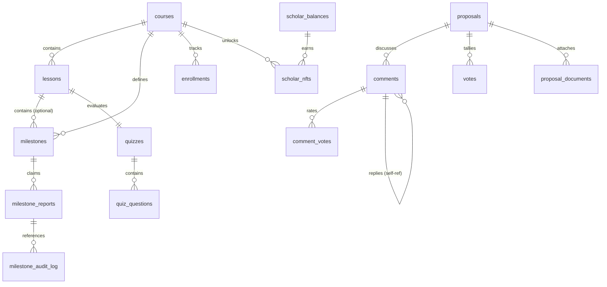

# LearnVault Relational Database Schema

This document defines the Postgres relational schema for **LearnVault**, compiled from migrations `001` through `008`.

## Entity-Relationship (ER) Diagram



---

## Detailed Table Specifications

### 1. `courses`
Tracks the global catalog of courses.
*   **Columns**:
    *   `id` (SERIAL, PRIMARY KEY): Unique identifier.
    *   `slug` (TEXT, UNIQUE, NOT NULL): URL-friendly string used as external identifier.
    *   `title` (TEXT, NOT NULL): Human-readable name.
    *   `description` (TEXT, NOT NULL): Detailed syllabus or explanation.
    *   `difficulty` (TEXT, CHECK (difficulty IN ('beginner', 'intermediate', 'advanced')), NOT NULL).
    *   `track` (TEXT, NOT NULL): Category (e.g. "Soroban", "Stellar SDK").
    *   `cover_image_url` (TEXT): IPFS or asset gateway reference.
    *   `lrn_reward` (NUMERIC(18, 7), DEFAULT 0, NOT NULL): The amount of LRN reputational token minted on completion.
    *   `published_at` (TIMESTAMP WITH TIME ZONE): Publication date.
    *   `created_at` (TIMESTAMP WITH TIME ZONE, DEFAULT CURRENT_TIMESTAMP, NOT NULL).
    *   `updated_at` (TIMESTAMP WITH TIME ZONE, DEFAULT CURRENT_TIMESTAMP, NOT NULL).
*   **Triggers**: `trg_courses_updated_at` (updates `updated_at` on modification).

### 2. `lessons`
Individual sections belonging to a course.
*   **Columns**:
    *   `id` (SERIAL, PRIMARY KEY).
    *   `course_id` (INTEGER, FOREIGN KEY REFERENCES `courses(id)` ON DELETE CASCADE, NOT NULL).
    *   `order_index` (INTEGER, NOT NULL): Sequence ordering within the course.
    *   `title` (TEXT, NOT NULL).
    *   `content_markdown` (TEXT, DEFAULT '', NOT NULL): Lesson text.
    *   `estimated_minutes` (INTEGER, DEFAULT 10, NOT NULL).
    *   `created_at`, `updated_at` (TIMESTAMP WITH TIME ZONE, DEFAULT CURRENT_TIMESTAMP, NOT NULL).
*   **Constraints**: `UNIQUE (course_id, order_index)` ensures no sequence overlap.
*   **Indexes**: `idx_lessons_course_id` on `(course_id)`.

### 3. `milestones`
Connects course modules to on-chain Soroban checkpoints.
*   **Columns**:
    *   `id` (SERIAL, PRIMARY KEY).
    *   `course_id` (INTEGER, FOREIGN KEY REFERENCES `courses(id)` ON DELETE CASCADE, NOT NULL).
    *   `lesson_id` (INTEGER, FOREIGN KEY REFERENCES `lessons(id)` ON DELETE SET NULL): Associated lesson.
    *   `on_chain_milestone_id` (INTEGER, NOT NULL): Index ID used inside the `CourseMilestone` Soroban contract.
    *   `lrn_amount` (NUMERIC(18, 7), DEFAULT 0, NOT NULL): Specific token award allocated to this milestone.
    *   `created_at`, `updated_at` (TIMESTAMP WITH TIME ZONE, DEFAULT CURRENT_TIMESTAMP, NOT NULL).
*   **Constraints**: `UNIQUE (course_id, on_chain_milestone_id)` ensures unique mapping.
*   **Indexes**: 
    *   `idx_milestones_course_id` on `(course_id)`
    *   `idx_milestones_lesson_id` on `(lesson_id)`

### 4. `quizzes`
Evaluations required to pass a lesson.
*   **Columns**:
    *   `id` (SERIAL, PRIMARY KEY).
    *   `lesson_id` (INTEGER, UNIQUE, FOREIGN KEY REFERENCES `lessons(id)` ON DELETE CASCADE, NOT NULL).
    *   `passing_score` (INTEGER, DEFAULT 70, NOT NULL).
    *   `created_at`, `updated_at` (TIMESTAMP WITH TIME ZONE, DEFAULT CURRENT_TIMESTAMP, NOT NULL).

### 5. `quiz_questions`
Individual multiple-choice items.
*   **Columns**:
    *   `id` (SERIAL, PRIMARY KEY).
    *   `quiz_id` (INTEGER, FOREIGN KEY REFERENCES `quizzes(id)` ON DELETE CASCADE, NOT NULL).
    *   `question_text` (TEXT, NOT NULL).
    *   `options` (JSONB, NOT NULL): Array of choices.
    *   `correct_index` (INTEGER, NOT NULL): Array pointer of correct answer.
    *   `explanation` (TEXT): Off-chain helper.
    *   `created_at`, `updated_at` (TIMESTAMP WITH TIME ZONE, DEFAULT CURRENT_TIMESTAMP, NOT NULL).
*   **Indexes**: `idx_quiz_questions_quiz_id` on `(quiz_id)`.

### 6. `milestone_reports`
Scholars' submissions claiming milestone completion.
*   **Columns**:
    *   `id` (SERIAL, PRIMARY KEY).
    *   `scholar_address` (TEXT, NOT NULL): Stellar address of the student.
    *   `course_id` (TEXT, NOT NULL): Course slug.
    *   `milestone_id` (INTEGER, NOT NULL): Internal milestone ID.
    *   `evidence_github` (TEXT): Pull Request or repository reference.
    *   `evidence_ipfs_cid` (TEXT): IPFS evidence asset hash.
    *   `evidence_description` (TEXT).
    *   `status` (TEXT, DEFAULT 'pending', CHECK (status IN ('pending', 'approved', 'rejected')), NOT NULL).
    *   `submitted_at` (TIMESTAMP WITH TIME ZONE, DEFAULT CURRENT_TIMESTAMP).
*   **Constraints**: `UNIQUE(scholar_address, course_id, milestone_id)` restricts duplicate claims.

### 7. `milestone_audit_log`
Chronicles reviewers' validation decisions.
*   **Columns**:
    *   `id` (SERIAL, PRIMARY KEY).
    *   `report_id` (INTEGER, FOREIGN KEY REFERENCES `milestone_reports(id)` ON DELETE CASCADE, NOT NULL).
    *   `validator_address` (TEXT, NOT NULL): Stellar address of the reviewer/DAO member.
    *   `decision` (TEXT, CHECK (decision IN ('approved', 'rejected')), NOT NULL).
    *   `rejection_reason` (TEXT).
    *   `contract_tx_hash` (TEXT): Stellar transaction hash representing the on-chain approval event.
    *   `decided_at` (TIMESTAMP WITH TIME ZONE, DEFAULT CURRENT_TIMESTAMP).

### 8. `ipfs_uploads`
Universal registry for tracked IPFS payloads.
*   **Columns**:
    *   `id` (SERIAL, PRIMARY KEY).
    *   `uploader_address` (TEXT, NOT NULL).
    *   `cid` (TEXT, UNIQUE, NOT NULL).
    *   `gateway_url` (TEXT, NOT NULL).
    *   `original_filename` (TEXT, NOT NULL).
    *   `mimetype` (TEXT, NOT NULL).
    *   `context` (TEXT): Context hint (e.g. `'milestone_evidence'`).
    *   `ref_id` (TEXT): Reference pointer.
    *   `created_at` (TIMESTAMP WITH TIME ZONE, DEFAULT CURRENT_TIMESTAMP).

### 9. `course_assets`
Course covers and attachments.
*   **Columns**:
    *   `course_id` (TEXT, NOT NULL).
    *   `asset_type` (TEXT, DEFAULT 'cover_image', NOT NULL).
    *   `cid` (TEXT, NOT NULL).
    *   `gateway_url` (TEXT, NOT NULL).
    *   `uploaded_by` (TEXT, NOT NULL).
    *   `created_at` (TIMESTAMP WITH TIME ZONE, DEFAULT CURRENT_TIMESTAMP).
*   **Constraints**: `PRIMARY KEY (course_id, asset_type)`.

### 10. `proposals`
Scholars' proposals seeking funding.
*   **Columns**:
    *   `id` (SERIAL, PRIMARY KEY).
    *   `author_address` (TEXT, NOT NULL).
    *   `title` (TEXT, NOT NULL).
    *   `description` (TEXT, NOT NULL).
    *   `amount` (NUMERIC(18, 7), DEFAULT 0, NOT NULL): USDC requested.
    *   `votes_for` (BIGINT, DEFAULT 0, NOT NULL).
    *   `votes_against` (BIGINT, DEFAULT 0, NOT NULL).
    *   `status` (TEXT, DEFAULT 'pending', CHECK (status IN ('pending', 'approved', 'rejected')), NOT NULL).
    *   `deadline` (TIMESTAMP WITH TIME ZONE).
    *   `cancelled` (BOOLEAN, DEFAULT FALSE, NOT NULL): Support for proposal withdrawal.
    *   `created_at` (TIMESTAMP WITH TIME ZONE, DEFAULT CURRENT_TIMESTAMP).
*   **Indexes**: `idx_proposals_status_created_at` on `(status, created_at DESC)`.

### 11. `proposal_documents`
Supplements attached to DAO scholarship proposals.
*   **Columns**:
    *   `id` (SERIAL, PRIMARY KEY).
    *   `proposal_id` (TEXT, NOT NULL).
    *   `uploader_address` (TEXT, NOT NULL).
    *   `cid` (TEXT, NOT NULL).
    *   `gateway_url` (TEXT, NOT NULL).
    *   `original_filename` (TEXT, NOT NULL).
    *   `created_at` (TIMESTAMP WITH TIME ZONE, DEFAULT CURRENT_TIMESTAMP).
*   **Indexes**: `idx_proposal_documents_proposal_id` on `(proposal_id)`.

### 12. `comments`
Discussion threads on governance proposals.
*   **Columns**:
    *   `id` (SERIAL, PRIMARY KEY).
    *   `proposal_id` (TEXT, NOT NULL).
    *   `author_address` (TEXT, NOT NULL).
    *   `parent_id` (INTEGER, FOREIGN KEY REFERENCES `comments(id)` ON DELETE CASCADE): Supports replies.
    *   `content` (TEXT, NOT NULL).
    *   `upvotes`, `downvotes` (INTEGER, DEFAULT 0).
    *   `is_pinned` (BOOLEAN, DEFAULT FALSE).
    *   `created_at` (TIMESTAMP WITH TIME ZONE, DEFAULT CURRENT_TIMESTAMP).
    *   `deleted_at` (TIMESTAMP WITH TIME ZONE).

### 13. `comment_votes`
Tracks upvotes and downvotes to prevent duplicate voting.
*   **Columns**:
    *   `id` (SERIAL, PRIMARY KEY).
    *   `comment_id` (INTEGER, FOREIGN KEY REFERENCES `comments(id)` ON DELETE CASCADE).
    *   `voter_address` (TEXT, NOT NULL).
    *   `vote_type` (TEXT, CHECK (vote_type IN ('upvote', 'downvote'))).
*   **Constraints**: `UNIQUE(comment_id, voter_address)`.

### 14. `votes`
Donor votes on scholarship proposals.
*   **Columns**:
    *   `id` (SERIAL, PRIMARY KEY).
    *   `proposal_id` (INTEGER, FOREIGN KEY REFERENCES `proposals(id)`, NOT NULL).
    *   `voter_address` (TEXT, NOT NULL).
    *   `support` (BOOLEAN, NOT NULL).
    *   `voting_power` (NUMERIC, NOT NULL).
    *   `tx_hash` (TEXT).
    *   `created_at` (TIMESTAMP WITH TIME ZONE, DEFAULT CURRENT_TIMESTAMP).
*   **Constraints**: `UNIQUE(proposal_id, voter_address)`.
*   **Indexes**:
    *   `idx_votes_proposal_id` on `(proposal_id)`
    *   `idx_votes_voter_address` on `(voter_address)`

### 15. `enrollments`
Course registration history.
*   **Columns**:
    *   `id` (SERIAL, PRIMARY KEY).
    *   `learner_address` (TEXT, NOT NULL).
    *   `course_id` (TEXT, NOT NULL).
    *   `tx_hash` (TEXT, NOT NULL).
    *   `enrolled_at` (TIMESTAMP WITH TIME ZONE, DEFAULT CURRENT_TIMESTAMP).
*   **Constraints**: `UNIQUE(learner_address, course_id)`.
*   **Indexes**:
    *   `idx_enrollments_learner_address` on `(learner_address)`
    *   `idx_enrollments_course_id` on `(course_id)`

### 16. `scholar_balances`
Denormalized local leaderboard cache.
*   **Columns**:
    *   `address` (TEXT, PRIMARY KEY).
    *   `lrn_balance` (NUMERIC(30, 0), DEFAULT 0, NOT NULL).
    *   `courses_completed` (INTEGER, DEFAULT 0, NOT NULL).
    *   `updated_at` (TIMESTAMP WITH TIME ZONE, DEFAULT CURRENT_TIMESTAMP, NOT NULL).
*   **Indexes**: `idx_scholar_balances_lrn_desc` on `(lrn_balance DESC, address ASC)`.

### 17. `scholar_nfts`
Minted credentials tracking.
*   **Columns**:
    *   `token_id` (BIGINT, PRIMARY KEY).
    *   `scholar_address` (TEXT, NOT NULL).
    *   `course_id` (TEXT, FOREIGN KEY REFERENCES `courses(slug)` ON DELETE CASCADE, NOT NULL).
    *   `metadata_uri` (TEXT, NOT NULL).
    *   `minted_at` (TIMESTAMP WITH TIME ZONE, DEFAULT CURRENT_TIMESTAMP, NOT NULL).
    *   `revoked` (BOOLEAN, DEFAULT FALSE, NOT NULL).
    *   `revoked_reason` (TEXT).
    *   `revoked_at` (TIMESTAMP WITH TIME ZONE).
*   **Indexes**:
    *   `idx_scholar_nfts_scholar_address` on `(scholar_address)`
    *   `idx_scholar_nfts_course_id` on `(course_id)`
    *   `idx_scholar_nfts_revoked` on `(revoked)`

### 18. `events`
Historical database index of Soroban contract events.
*   **Columns**:
    *   `id` (SERIAL, PRIMARY KEY).
    *   `contract` (TEXT, NOT NULL).
    *   `event_type` (TEXT, NOT NULL).
    *   `data` (JSONB, NOT NULL).
    *   `ledger_sequence` (BIGINT, NOT NULL).
    *   `created_at` (TIMESTAMP WITH TIME ZONE, DEFAULT CURRENT_TIMESTAMP, NOT NULL).
*   **Constraints**: `UNIQUE(contract, ledger_sequence)` prevents duplicates.
*   **Indexes**:
    *   `idx_events_contract_event_ledger` on `(contract, event_type, ledger_sequence)`
    *   `idx_events_contract_type` on `(contract, event_type)`
    *   `idx_events_created_at` on `(created_at DESC)`
    *   `idx_events_data_gin` using GIN on `(data)`

### 19. `platform_events`
General analytics event logging.
*   **Columns**:
    *   `id` (SERIAL, PRIMARY KEY).
    *   `event_type` (TEXT, NOT NULL).
    *   `data` (JSONB, DEFAULT '{}'::jsonb, NOT NULL).
    *   `created_at` (TIMESTAMP WITH TIME ZONE, DEFAULT CURRENT_TIMESTAMP, NOT NULL).
*   **Indexes**:
    *   `idx_platform_events_type_created_at` on `(event_type, created_at DESC)`
    *   `idx_platform_events_created_at` on `(created_at DESC)`

---

## Indexing Strategy & Performance Rationale

1.  **Composite Index Coverages**: Composite indexes like `idx_proposals_status_created_at` on `(status, created_at DESC)` allow the Express router to execute ordered pagination queries instantly without triggering high-overhead database sorting algorithms.
2.  **Referential Key Indexes**: Explicit secondary indexes are declared on foreign key columns (like `idx_lessons_course_id` and `idx_votes_proposal_id`) to accelerate cascade joins during nested REST response generation.
3.  **No-Duplicates Constraint Backups**: `UNIQUE` indexes are created implicitly for key composite relations (like `(scholar_address, course_id, milestone_id)`) to enforce database-level validation, shielding ledger state against double-submit bugs.
4.  **JSONB Search Speeds**: The `events` container logs are indexed using a GIN search model (`idx_events_data_gin`), enabling fast document-level filtering on deep structural payload fields like `data.address` or `data.amount`.

---

## Schema Maintenance & Automation

To keep this documentation in alignment with the database migrations:

1.  **pg-describe Integration**: Execute the build schema extraction script:
    ```bash
    npm run db:schema:export
    ```
2.  **Dry-run Validations**: CI workflows are set up to map current `knex` migrate boundaries against this file. Any schema updates must have a corresponding edit in this document.
